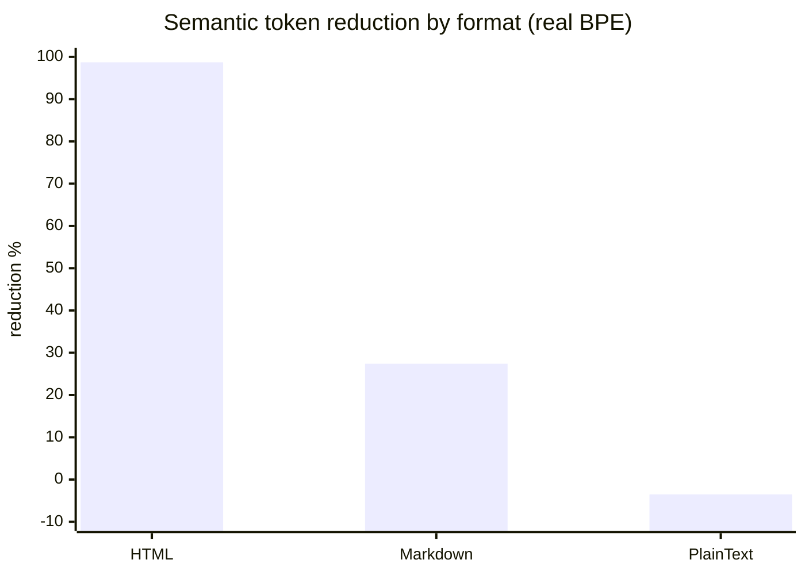
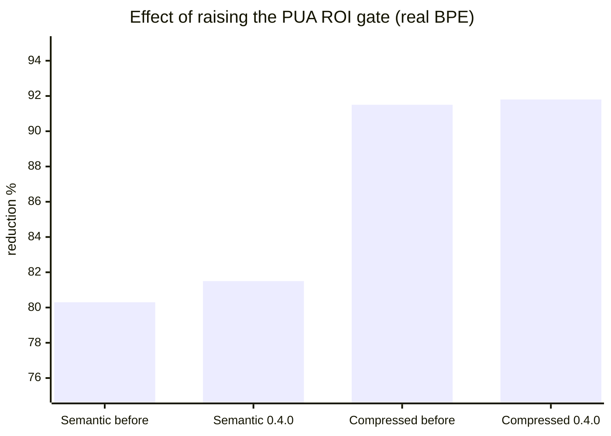

# Evaluation & Token-Honesty Analysis

> Version: **0.4.0** · Methodology: real `cl100k_base` BPE tokenizer (`tiktoken-rs`) + heuristic dual-report · Dataset: 48 documents across Markdown / HTML / PlainText

This document is the **honest** evaluation of llm-transpile's token-reduction claims. It supersedes the legacy `eval/EVAL_REPORT.md`, whose numbers were measured with this project's *own* heuristic tokenizer — making them self-referential and inflated. For the fix story, see [§ How the measurement was broken](#how-the-measurement-was-broken).

---

## TL;DR

| Claim | Verdict |
|-------|---------|
| "Reduces tokens" | ✅ Markdown **27.4%** (BPE), HTML **98.7%** (markup strip), PlainText **−3.5%** (overhead > savings) |
| "PUA symbol substitution saves tokens" | ❌ **Net-negative for ordinary words.** Substitution only pays for 4+ token terms. The 0.4.0 ROI gate now enforces this. |
| "Quality preserved" | ✅ Lossless word coverage **99.0%** |
| Speed | ✅ **~1,070 tok/ms** (Rust) |
| Measurement trustworthy | ✅ As of 0.4.0 — dual heuristic/BPE report; composite derived from BPE |

**The single most important number:** the headline "up to 40% reduction" only describes the *Markdown average* band. Across all formats the picture is far more uneven.

---

## Headline numbers (v0.4.0)

```json
{
  "documents": 48,
  "input_tokens_bpe": 502068,
  "semantic_tokens_bpe": 92973,
  "compressed_tokens_bpe": 41159,
  "semantic_reduction_bpe_pct": 81.5,
  "compressed_reduction_bpe_pct": 91.8,
  "lossless_coverage_pct": 99.0,
  "throughput_tok_per_ms": 1072,
  "composite": 0.997
}
```

> ⚠️ The aggregate 81–92% reduction is **dominated by HTML** (5 files = 74% of input tokens), where the reduction is markup stripping, not compression. Per-format numbers tell the real story.

## Per-format breakdown (real cl100k BPE)

| Format | Files | Semantic reduction | Compressed reduction | Lossless vs input |
|--------|------:|-------------------:|---------------------:|------------------:|
| **HTML** | 5 | **98.7%** | 99.3% | −91.9% (nav/script/style stripped) |
| **Markdown** | 40 | **27.4%** | 69.4% | −25.5% (structural overhead) |
| **PlainText** | 3 | **−3.5%** ⚠️ | 30.4% | +1.0% |



### Interpretation

- **HTML 98.7% is not "compression."** `ammonia` strips navigation, `<script>`, `<style>`, and boilerplate. The remaining prose compresses at Markdown-like rates. This is valuable but is *HTML-to-text normalization*, achievable with `html2text` / `trafilatura`.
- **Markdown 27.4% is the project's genuine compression ability** — stopword pruning, low-importance paragraph pruning, deduplication. This is where the real engineering value lives.
- **PlainText is −3.5% in Semantic mode**: the `<H><B>` structural wrapper adds more tokens than compression removes. PlainText users should use `Lossless` (no overhead growth) or accept the trade-off.

---

## How the measurement was broken (the 0.4.0 fix)

### The self-reference problem

Before 0.4.0, reduction was measured with `token_count()`, a character-count heuristic. That heuristic encodes one critical assumption:

> **A Unicode PUA character (U+E000–U+F8FF) costs 1 token.**

The compressor's symbol substitution (`SymbolDict`) optimizes *for* that assumption — it replaces frequent terms with PUA chars precisely because the heuristic says each costs only 1 token. **Measurer and subject shared one assumption**, so the reduction numbers were circular and inflated.

### The ground truth (measured with real cl100k)

PUA codepoints are absent from cl100k's merge table, so each encodes via **byte-fallback to 3 tokens** — not 1.

| Text | Heuristic assumption | Real cl100k |
|------|---------------------:|------------:|
| 1 PUA char | 1 | **3** |
| 8 distinct PUA chars | 8 | **24** |
| "about" / "performance" / "documentation" | ~2 | **1** |
| "large language model" | ~6 | **3** (= PUA cost → zero saving) |
| "API endpoint" | multi | **2** (< PUA 3 → substitution *increases* tokens) |

**Direct experiment** — substituting ordinary terms with PUA chars:

| Term | Original BPE | After PUA | Result |
|------|-------------:|----------:|--------|
| transformer | 2 | 3 | **+1 token** ✗ |
| documentation | 1 | 3 | **+2 tokens** ✗ |
| configuration | 1 | 3 | **+2 tokens** ✗ |
| tokenizer | 1 | 3 | **+2 tokens** ✗ |
| **"transformer fine-tuning documentation configuration tokenizer"** | **8** | **19** | **+11 (+137%)** ✗ |

Ordinary English words are already 1–2 tokens. Replacing any of them with a 3-token PUA char is always a loss. PUA substitution only pays when a term costs **4+ tokens**.

### The fix

1. **Dual measurement** (`measure_tokens_dual`): always report both heuristic and BPE counts. The composite score is derived from BPE.
2. **ROI gate raised to 4+ tokens** (`PUA_TOKEN_COST = 3`): a term is only PUA-substituted when `term_tokens > 3` **and** the net saving after dictionary overhead is strictly positive.

### Measured effect of the fix

| Document | PUA chars before | PUA chars after 0.4.0 |
|----------|----------------:|----------------------:|
| `hub-docs_model_cards_metadata.md` | 50 | **0** |
| `diffusers_dreambooth_training.md` | 35 | **0** |

Removing ROI-negative substitutions **improved** the real reduction:

| Metric (BPE) | Before gate fix | 0.4.0 |
|--------------|----------------:|------:|
| Semantic reduction | 80.3% | **81.5% (+1.2pp)** |
| Compressed reduction | 91.5% | **91.8% (+0.3pp)** |



---

## Reproducing the evaluation

```bash
# Structured JSON (consumed by `epic eval`; reports both heuristic and BPE)
make eval

# Human-readable per-file table + summary
make eval-report

# Within the `epic` harness
epic eval --json
```

The eval example requires the `tiktoken` feature (`make eval` enables it automatically), because the heuristic alone is self-referential for this crate's own output.

### Composite score formula

`composite` (0.0–1.0) is derived from the **BPE** numbers:

| Component | Weight | Normalization |
|-----------|-------:|---------------|
| reduction | 0.40 | semantic BPE reduction, saturated at 40% |
| coverage | 0.30 | lossless word coverage / 100 |
| throughput | 0.15 | log10-scaled tok/ms, saturated at 1000 |
| lossless overhead | 0.15 | penalty if Lossless adds tokens vs input |

---

## Known limitations

- **Quality (LLM-as-judge) is not yet re-run at scale.** The legacy `quality_bench.py` sampled 5 documents / 15 questions and found Compressed mode scored slightly *lower* than raw (−0.20/10). That signal stands; a larger re-bench is the recommended follow-up.
- **`performance` dimension is SKIPPED in `epic eval`** (no separate bench command wired); throughput is captured inside the composite benchmark instead.

## Recommended follow-ups

1. Re-run LLM-as-judge quality bench on 50+ documents against a standard QA dataset.
2. Consider lowering `DICT_ENTRY_OVERHEAD` only after the QA bench confirms substitution never harms comprehension.
