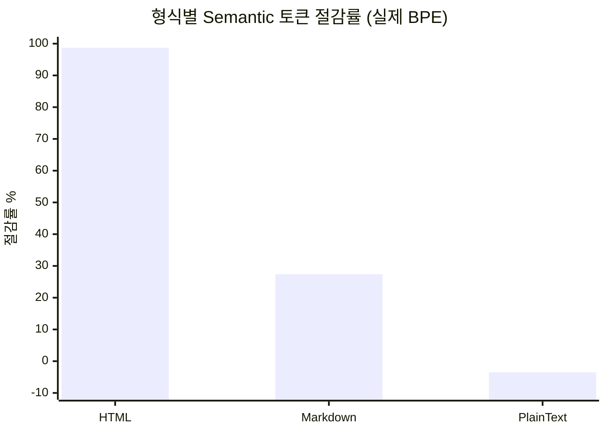
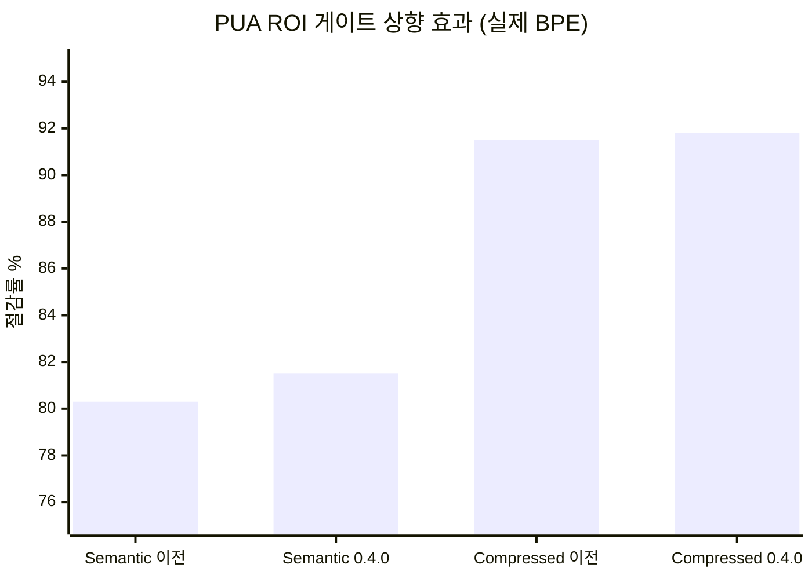

# 평가 및 토큰 정직성 분석

> 버전: **0.4.0** · 방법론: 실제 `cl100k_base` BPE 토크나이저(`tiktoken-rs`) + 휴리스틱 이중 보고 · 데이터셋: Markdown / HTML / PlainText 형식의 문서 48개

이 문서는 llm-transpile의 토큰 절감 주장에 대한 **정직한** 평가입니다. 이 프로젝트 *자체*의 휴리스틱 토크나이저로 측정해 자기참조적이고 과장되었던 기존 `eval/EVAL_REPORT.md`를 대체합니다. 수정 스토리는 [§ 측정이 어떻게 망가졌나](#측정이-어떻게-망가졌나)를 보세요.

---

## 요약

| 주장 | 판정 |
|------|------|
| "토큰을 절감한다" | ✅ Markdown **27.4%**(BPE), HTML **98.7%**(마크업 제거), PlainText **−3.5%**(오버헤드 > 절감) |
| "PUA 심볼 치환이 토큰을 절감한다" | ❌ **일반 단어에는 순손실.** 4+ 토큰 용어에서만 유효. 0.4.0 ROI 게이트가 이를 강제. |
| "품질 보존" | ✅ Lossless 단어 보존율 **99.0%** |
| 속도 | ✅ **약 1,070 tok/ms**(Rust) |
| 측정 신뢰성 | ✅ 0.4.0부터 — heuristic/BPE 이중 보고, composite는 BPE에서 도출 |

**가장 중요한 수치 하나:** 헤드라인 "최대 40% 절감"은 *Markdown 평균* 구간만 설명합니다. 전체 형식을 보면 그림이 훨씬 불균등합니다.

---

## 핵심 수치 (v0.4.0)

```json
{
  "documents": 48,
  "input_tokens_bpe": 502068,
  "semantic_tokens_bpe": 92973,
  "compressed_tokens_bpe": 41159,
  "semantic_reduction_bpe_pct": 81.5,
  "compressed_reduction_bpe_pct": 91.8,
  "lossless_coverage_pct": 99.0,
  "throughput_tok_per_ms": 1072,
  "composite": 0.997
}
```

> ⚠️ 전체 81–92% 절감은 **HTML이 지배**합니다(파일 5개 = 입력 토큰의 74%). HTML 절감은 압축이 아니라 마크업 제거입니다. 형식별 수치가 진짜 그림을 보여줍니다.

## 형식별 분해 (실제 cl100k BPE)

| 형식 | 파일 | Semantic 절감 | Compressed 절감 | Lossless vs 입력 |
|------|-----:|--------------:|----------------:|----------------:|
| **HTML** | 5 | **98.7%** | 99.3% | −91.9%(nav/script/style 제거) |
| **Markdown** | 40 | **27.4%** | 69.4% | −25.5%(구조 오버헤드) |
| **PlainText** | 3 | **−3.5%** ⚠️ | 30.4% | +1.0% |



### 해석

- **HTML 98.7%는 "압축"이 아닙니다.** `ammonia`가 내비게이션, `<script>`, `<style>`, 보일러플레이트를 제거합니다. 남은 산문은 Markdown과 비슷한 비율로 압축됩니다. 가치는 있지만 *HTML→텍스트 정규화*이며 `html2text` / `trafilatura`로 대체 가능합니다.
- **Markdown 27.4%가 이 프로젝트의 진짜 압축 능력** — stopword 가지치기, 저중요 단락 가지치기, 중복 제거. 실제 엔지니어링 가치가 있는 곳입니다.
- **PlainText는 Semantic 모드에서 −3.5%**: `<H><B>` 구조 래퍼가 압축으로 제거하는 양보다 토큰을 더 추가합니다. PlainText 사용자는 `Lossless`(오버헤드 증가 없음)를 쓰거나 트레이드오프를 받아들여야 합니다.

---

## 측정이 어떻게 망가졌나 (0.4.0 수정)

### 자기참조 문제

0.4.0 이전에는 절감을 `token_count()`라는 문자 수 휴리스틱으로 측정했습니다. 이 휴리스틱은 하나의 치명적 가정을 품고 있습니다:

> **유니코드 PUA 문자(U+E000–U+F8FF) 1개 = 1 토큰.**

압축기의 심볼 치환(`SymbolDict`)은 *바로 이 가정을 위해* 최적화합니다 — 휴리스틱이 각 PUA를 1토큰으로 계산하니 빈도 높은 용어를 PUA로 바꿉니다. **측정자와 피측정물이 하나의 가정을 공유**해서 절감 수치가 순환적이고 과장되었습니다.

### 진실 (실제 cl100k로 측정)

PUA 코드포인트는 cl100k 병합 테이블에 없어서 각각 **바이트 폴백으로 3 토큰**으로 인코딩됩니다 — 1이 아닙니다.

| 텍스트 | 휴리스틱 가정 | 실제 cl100k |
|------|--------------:|------------:|
| PUA 문자 1개 | 1 | **3** |
| PUA 8개(서로 다른) | 8 | **24** |
| "about" / "performance" / "documentation" | ~2 | **1** |
| "large language model" | ~6 | **3**(= PUA 비용 → 절감 0) |
| "API endpoint" | 다중 | **2**(< PUA 3 → 치환이 토큰을 *증가*) |

**직접 실험** — 일반 용어를 PUA로 치환:

| 용어 | 원본 BPE | PUA 치환 후 | 결과 |
|------|---------:|----------:|------|
| transformer | 2 | 3 | **+1 토큰** ✗ |
| documentation | 1 | 3 | **+2 토큰** ✗ |
| configuration | 1 | 3 | **+2 토큰** ✗ |
| tokenizer | 1 | 3 | **+2 토큰** ✗ |
| **"transformer fine-tuning documentation configuration tokenizer"** | **8** | **19** | **+11 (+137%)** ✗ |

일반 영어 단어는 이미 1–2 토큰입니다. 이를 3토큰짜리 PUA로 바꾸는 것은 항상 손해입니다. PUA 치환은 용어가 **4+ 토큰**일 때만 유효합니다.

### 수정

1. **이중 측정**(`measure_tokens_dual`): heuristic과 BPE 카운트를 항상 함께 보고. composite 점수는 BPE에서 도출.
2. **ROI 게이트 4+ 토큰으로 상향**(`PUA_TOKEN_COST = 3`): `term_tokens > 3`이고 사전 오버헤드를 뺀 순 절감이 확실히 양수일 때만 PUA 치환.

### 수정의 실측 효과

| 문서 | 0.4.0 이전 PUA 문자 | 0.4.0 이후 |
|------|------------------:|----------:|
| `hub-docs_model_cards_metadata.md` | 50 | **0** |
| `diffusers_dreambooth_training.md` | 35 | **0** |

역효과 치환을 제거하자 실제 절감이 **개선**되었습니다:

| 지표 (BPE) | 게이트 수정 전 | 0.4.0 |
|-----------|---------------:|------:|
| Semantic 절감 | 80.3% | **81.5%(+1.2pp)** |
| Compressed 절감 | 91.5% | **91.8%(+0.3pp)** |



---

## 평가 재현

```bash
# 구조화 JSON(epic eval이 소비; heuristic과 BPE를 모두 보고)
make eval

# 사람용 파일별 표 + 요약
make eval-report

# epic 하네스 안에서
epic eval --json
```

eval example은 `tiktoken` 피처를 요구합니다(`make eval`이 자동 활성화). 휴리스틱 단독은 이 크레이트 자체 출력에 대해 자기참조적이기 때문입니다.

### composite 점수 공식

`composite`(0.0–1.0)은 **BPE** 수치에서 도출됩니다:

| 구성 요소 | 가중치 | 정규화 |
|-----------|------:|--------|
| 절감 | 0.40 | semantic BPE 절감, 40%에서 포화 |
| 보존 | 0.30 | lossless 단어 보존율 / 100 |
| 속도 | 0.15 | log10 스케일 tok/ms, 1000에서 포화 |
| lossless 오버헤드 | 0.15 | Lossless가 입력 대비 토큰을 추가하면 페널티 |

---

## 알려진 한계

- **품질(LLM-as-judge)은 아직 대규모로 재실행되지 않음.** 기존 `quality_bench.py`는 5문서 / 15질문을 표본삼아 Compressed 모드가 raw보다 약간 *낮게* 점수(−0.20/10)를 받는다고 했습니다. 이 신호는 유효하며, 더 큰 재벤치가 권장 후속입니다.
- **`performance` 차원이 `epic eval`에서 SKIPPED**(별도 bench 명령 미연결). 속도는 composite 벤치마크 안에서 포착됩니다.

## 권장 후속

1. 표준 QA 데이터셋으로 50+ 문서에서 LLM-as-judge 품질 벤치 재실행.
2. QA 벤치가 치환이 이해도를 해치지 않음을 확인한 뒤에만 `DICT_ENTRY_OVERHEAD`를 낮추는 것을 고려.
